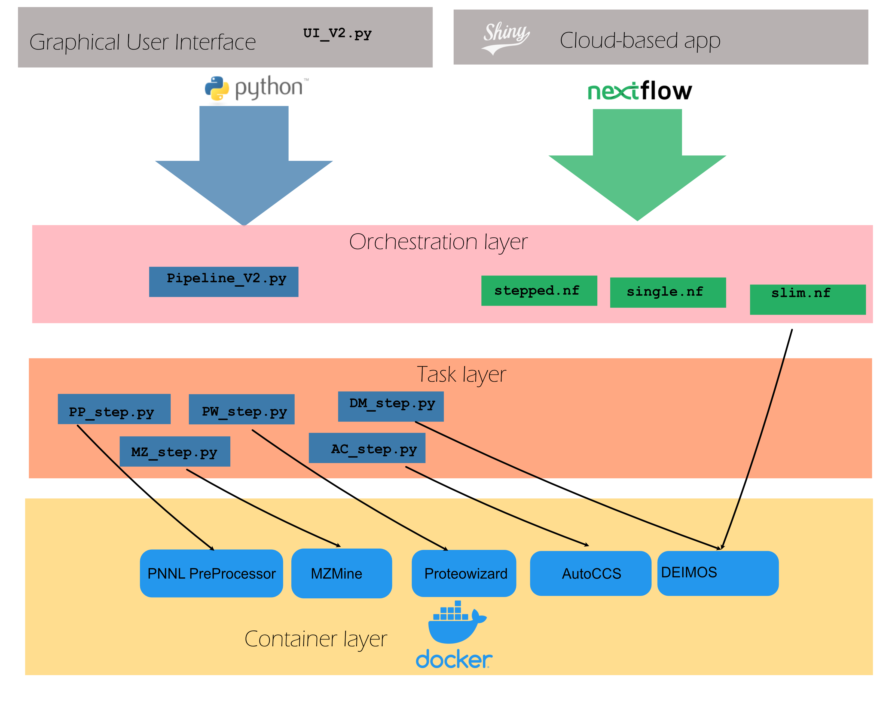

# Ion Mobility Dashboard
This is a workflow for analyzing Ion Mobility - Mass Spectrometry data. The primary goal is to facilitate the numerous steps required to analyze and interpret this type of data, as it requires numerous steps and file management can be a burden.

The full documentation, instructions on usage, tool descriptions, and troubleshooting tips should be viewed at our [Documentation](https://ionmobility.readthedocs.io/en/latest/background/info.html) site.

Current reports: 

## Availability
**Windows** GUI executable **NOT** up to date.   
**Mac** GUI executable on Zenodo **NOT** up to date.  
**Cloud (AWS)** version available.   
**High Performance Computing (HPC)** version available.   
Docker Version 4.12x has known issues (exec_run fails). Please use an earlier distribution.   

## Architecture
The system is designed to enable users to run individual parts via the command line, using a graphical user interface, or using Nextflow. Currently only the GUI portions are implemented, however we believe that in subsequent versions we will be able to automate the analysis as shown below.

Each mode has separate needs for input files, but runs a combination of the modules depicted below.

### Containerized framework
The guiding design principle behind the Ion Mobility Dashboard is to enable the use of existing tools for reproducible analysis of Ion Mobility Mass Spectrometry data. The use of Docker (GUI and Cloud) and Singularity (HPC) enables this abstraction to be flexible as we want to run a series of tools in a scalable manner.

### Task framework

The task framework, shown above in orange, depicts wrapper scripts that run each Docker container. These can also be expanded as more docker containers are added.

### Orchestration

The orchestration layer enables the linking of individual tasks together. For example, in our Dashboard we allow for the analysis of Ion Mobility data collected via a single field or stepped field. As such, we must run different tools.

### User interface
The user interface module enables users to upload files directly to the system.

## Installation
To download and use this tool, please check out our [Documentation](https://ionmobility.readthedocs.io/en/latest/background/info.html) site for more details.

## Contribution

To contribute, please post an issue to the GitHub page. We are eager to include other tools in this framework.

## Summary
This framework will enable the end-to-end analysis of Ion Mobility MS-MS data.
