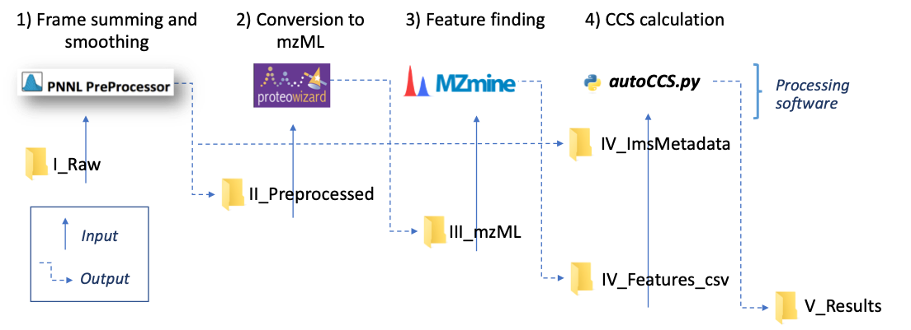

# ion-mob-ms
This is a workflow for analyzing Ion Mobility Mass-Spectrometry data. It comprises scripts and images that run diverse tools and a graphical user interface that runs data from specific experimental files. Our goal is to analyze data from three types of experiments:
1. DTIMS single field: Drift tube ion mobility mass spectrometry requires knowledge of experiments and a table of calibration ions.
2. SLIM data (also single field): Data from the SLIM machine.
3. DTIMS stepped field: Drift tube ion mobiology mass spectrometry that requires specific known targets and their masses.

Each mode has separate needs for input files, but runs a combination of the modules depicted below.

## To run ion-mob-ms

TODO: how do we install? Need to write script that installs Docker, Nextflow and any Python needed for UI front end.

## Workflow components
The archiecture of this toolbox is shown above, with each of the scripts to run each model here.

### PNNL PreProcessor Tool
Docker image and script to run [PNNL Pre-Processor tool](https://pnnl-comp-mass-spec.github.io/PNNL-PreProcessor).

### ProteoWizard Tool
Docker image and script to run [ProteoWizard tool](https://proteowizard.sourceforge.io/)

### MZMine Tool
Docker image and script to run [MZMine Java Program](http://mzmine.github.io/).

### AutoCCS Tool
Docker image and script to run [AutoCCS Python script](https://github.com/PNNL-Comp-Mass-Spec/AutoCCS).

### ion-mob-UI
This is the front-end for the entire workflow.  TODO: determine implementation and design.

## Summary
This framework will enable the end-to-end analysis of Ion Mobility MS-MS data.
