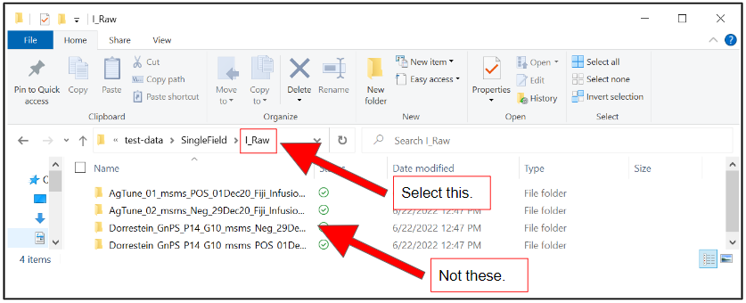
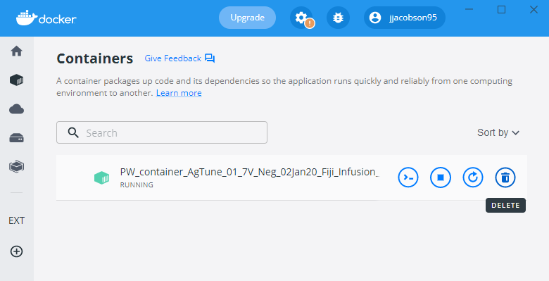

## Ion Mobility Mass Spec Dashboard
  
  
The Ion Mobility Mass Spec Dashboard is designed to allow scientists to generate results from raw Ion Mobility-Mass Spectrometry data without requiring assistance from an engineer or bioinformatician. This dashboard links four sequential command line tools into a single user-friendly application. This application communicates with Docker Desktop to dynamically spin up docker containers and manage a filesystem. Each tool has been dockerized and together perform the floowing steps: quality control data processing, file type conversion (from proprietary to an open-source format), detection of unique features, and calculation of collision-cross section (CCS).
  
  
## Ion Mobility Spectrometry-Mass Spectrometry (IMS-MS) Background  
  
Mass Spectrometry (MS) is used to identify and differentiate unknown molecules by comparing intensities and mass-to-charge-ratio (m/z). This is important in clinical research and drug development, however, this method stuggles with identifying small molecules, isomers, or enantiomers. To increase the accuracy of molecular identification, MS can be paired with Ion Mobility Spectrometry (IMS). IMS generates an additional descriptive variable called collision cross section (CCS) which can further differentiate between these molecules.  
  
This application analyzes three methods of ion mobility spectrometry: single field drift tube ion mobility spectrometry (single field DTIMS), stepped field drift tude ion mobility spectrometry (stepped field DTIMS), and structures for lossless ion manipulations (SLIM).   
  
**Drift Tube Ion Mobility Spectrometry**  
  
DTIMS seperates ions by collision cross section. This works accelerating ions through a straight tube filled with an inert buffer gas, as the ions pass through the tube, they bump into buffer gas molecules and are slowed down. Drift (retention) time is used as a predictor of CCS as ions with a greater CCS collide with and are slowed by buffer molecules, the inverse is true with small molecules. Single field DTIMS uses a single electrical field to accelerate ions through the tube. This differs from stepped field DTIMS which uses an alternating electrical curent to propel ions though the tube. Length of drift tube increases resolution and as such, both methods of DTIMS are limited by instrument space.

**Structures for Lossless Ion Manipulations**  
  
SLIM uses the same principal as single field DTIMS without the limitation of drift tube length. This technology allows the ions to be pushed around corners without colliding with path walls; this allows for significantly longer paths resulting in much greater resolution of ion CCS values.  
  
  
## How to install  
  
Two applications are required to run workflows: Docker Desktop, and UI_V2. 
  
**Mac Installation**:  
1. Download UI_V2  
2. Download [Docker Desktop for Mac](https://docs.docker.com/desktop/mac/install/)  
3. Restart computer if prompted  
4. Open Docker Desktop and then UI_V2 
  
**Windows Installation**:  
1. Download [Ion_Mob_PC.exe](https://github.com/PNNL-CompBio/ion-mob-ms/blob/main/UserInterfaceV2/Ion_Mob_PC.exe)  
2. Download [Docker Desktop for Windows](https://docs.docker.com/desktop/windows/install/)    
3. Install WSL2 via PowerShell. Open "Powershell" as an **Administrator**, then type the command "wsl --install -d ubuntu"  
  
   
  
4. Restart computer   
5. Open Docker Desktop and then UI_V2 
  

**Dashboard Image**  

  
  
## Run Overview  
1) Workflow choice will be dictated by which type of experiment you are running. The option to run any individual tool is also available.   
2) Depending on which workflow you'd like to run,a set of files and folders must be prepared ahead of time. 
3) Enter values for parameters and use a unique experiment name. Avoid spaces or any special characters in this name.  
4) Double check parameter inputs, files, then run the experiment.
5) If AutoCCS was performed, you will be able to view a preview of the results. If this does not appear, the experiment may have failed.
6) Save results to folder. Do not use a duplicate folder name. Once results are saved, they will be removed from the application workspace.  

  
## Select your Workflow  
  
There are three types of workflows to run. Each mode has separate needs for input files, but runs a combination of the modules depicted below.
  
**DTIMS Single field**  

Drift tube ion mobility mass spectrometry requires knowledge of experiments and a table of calibration ions.  
  
**DTIMS Stepped field**  

Drift tube ion mobility mass spectrometry that requires specific known targets and their masses.  
  

**SLIM**  
Data from the SLIM machine.  
   
  
### Single Tool Option 
This option is selected to run tools individually.  
  
Select which tool you would like to run. Grey boxes are unavailable, white boxes are available, and the orange box indicates which is selected.
 
 
  
If AutoCCS is selected, choose single field, stepped field, or SLIM depending on your experiment.  
  
   
  
  
## Prepare your Files  
Examples of each data type can be found in the test data in the [github repository](https://github.com/PNNL-CompBio/ion-mob-ms/).

**Raw Data Folder**  
Raw data is generated by vendor instruments. This data is commonly encoded in a propriatory format. All raw data must be together in an encompassing folder, some raw data types such as Agilent (.d) are folders themselves, these must still be isolated in an encompassing folder. See more details in section titled "Upload your files" below. Supported file types can be found [here](https://proteowizard.sourceforge.io/doc_users.html).    
    
 **IMS Metadata Folder**   
This data is generated alongside and paired with the raw data by some vendors. It includes information such as instrument specifications, temperature deviations between runs, and electrical current changes. This is required for stepped field experiments and optional for single field experiments. Including this data for single field experiments improves accuracy of CCS value predictions.  
   
**Feature Data Folder**  
Feature files are generated by Mzmine or DEIMoS. Features, also known as peaks, are predicted based on signal-to-noise ratio of drift time, intensity, and mass/charge (m/z) ratios.  
  
**Target List File**  
This excel file is required for stepped field experiments. This contains four columns: compound name, compound ID, exact mass, unique ID4D file names.  
This must be created by the user with known molecules/standards and neutral masses in order to compare with sample data and calculate CCS values.
  
**Metadata File**  
This metadata files includes the following data for each sample: RawFileName, AcquiredTime, InstrumentName, IonPolarity, Well, Cartridge. This is generated for agilent data after PNNL PreProcessor. **How is this generated othwerwise...?**  
  
**Calibrant File**  
This text file includes calibrant information for single field experiments. Calibrant information includes: CCS values, mass(m), charge(z), m/z, and ionization.   
  
  
  
## Upload your files  
  
To upload files/folders, please sort each file type into their own folder, then select the folder by clicking "Browse".  
For example, all Raw data files should be placed in a single folder without any other files. This includes data types such as Agilent (.d) which are folders themselves - ie: select the encompassing folder/directory which holds one or more raw data types, not the data files themselves.  
  
   
 
Individual File uploads do not require folders and may be selected directly. These include: Calibrant File, Target List File, and Metadata File.  
  
Once files are uploaded, select the Run tab.  
  
 
  
## Run Experiment  
  
**Prior** to selecting "Run Experiment", Docker must be open.
  
  
  
Please confirm all variables and path locations before running experiment.  

 
  
When running experiment, do not exit the application or Docker. Doing so may result in temporary files (such as .tar files in data folders) not being deleted. 
If exited early, please ensure no temporary files exist in experimental folders before running again.  
  
## Viewing and Saving Results  
  
  
After an experiment is completed, a "Save Results" button should appear. Select this button to find a folder to save results at. 
  
 
  
If CCS Values were generated, a summary graph or PDF will be available to preview depending on the experiment type.  
  
  
## Running Additional Experiments  
 
To clear all parameters and results, select the "Clear Experiment" button and confirm. Save results before clearing or they will be lost.  
  
 
  
  
## Errors and Troubleshooting  
  
**Docker Errors**  
Connectivity issues between Docker Desktop and UI_V2 may lead to issues with experiments completing. When an error message is seen in the console, check which data file was running, then manually **Delete** all containers in docker desktop and **restart** both applications. Last, check data files to ensure that no intermediate files (.tar extension) were left behind.  
  
The most common error is a connectivity timeout error, this may occur when the computer logs out or enters sleep mode partway through a run. This issue becomes more frequent when Docker Desktop is not restarted between runs.   
  
Two docker containers with the same name can not be run at the same time, ensure that all files have unique names and no docker containers are running or stopped before starting an experiment (these must be deleted).  
  
 
  
**Recovering Data**  
When a docker container exits on its own, its experiment was completed successfully. When left running indefinitely, it has failed.
To retrieve any data from partial runs, see the message console to find the location or "Working Directory" of the run. Data is deleted upon exit of the application and must be retrieved before then.  
  
 **Docker Setup on Windows**  
Docker requires WSL2 to be enabled. This should be automatically enabled, is not enter "Settings", then on the "General" page, select the box titled "Use the WSL 2 based engine". Then select "Apply and Restart".  
   
   
## Available Tools

Currently we have enabled the use of the following tools. 

### PNNL PreProcessor Tool - Unavailable
Docker image and script to run [PNNL Pre-Processor tool](https://pnnl-comp-mass-spec.github.io/PNNL-PreProcessor).

### ProteoWizard Tool
Docker image and script to run [ProteoWizard tool](https://proteowizard.sourceforge.io/)

### MZMine Tool - Unavailable
Docker image and script to run [MZMine Java Program](http://mzmine.github.io/).

### AutoCCS Tool
Docker image and script to run [AutoCCS Python script](https://github.com/PNNL-Comp-Mass-Spec/AutoCCS).

### ion-mob-UI 
This is the front-end for the entire workflow.  TODO: determine implementation and design.

## Citation
