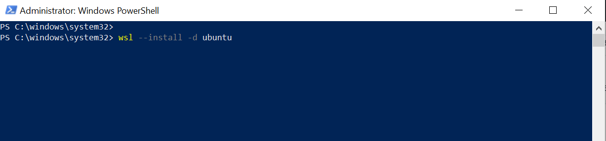
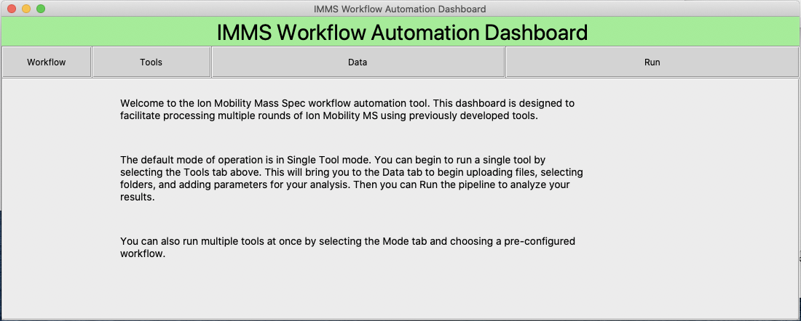
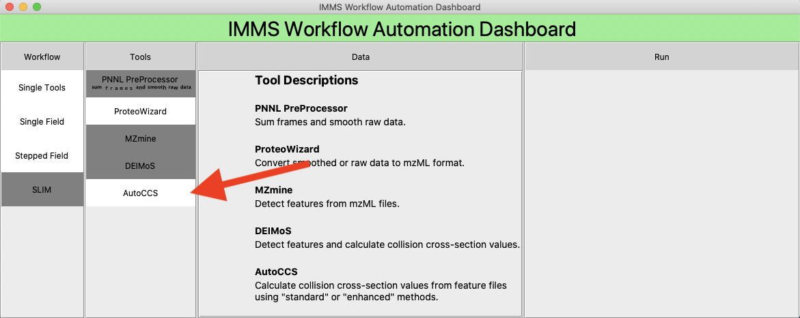
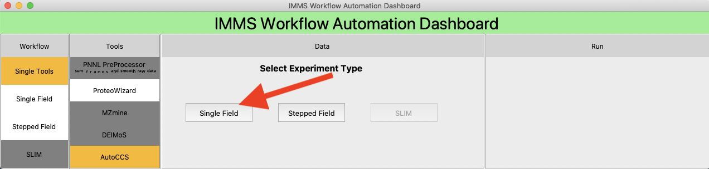
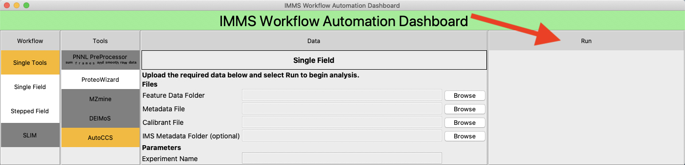
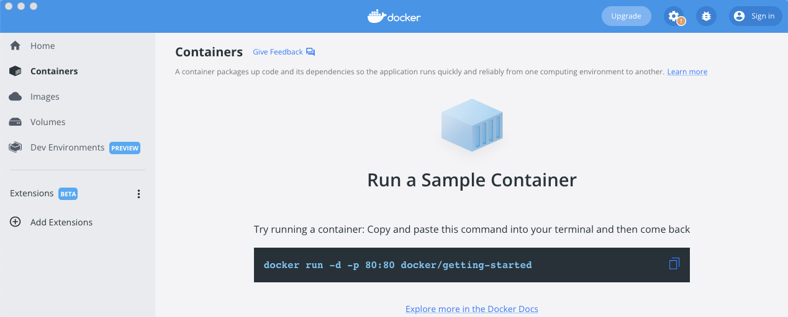
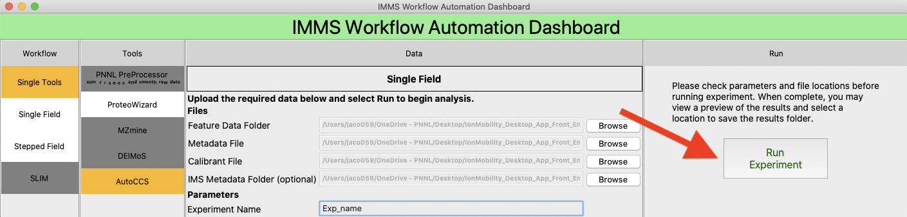
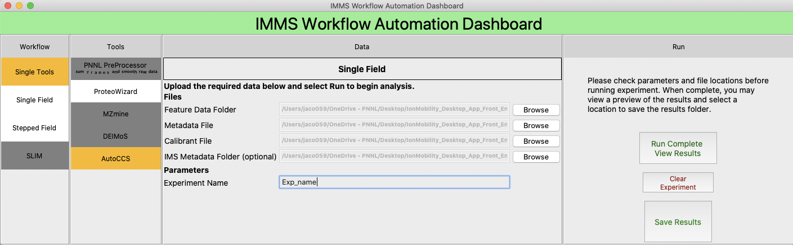
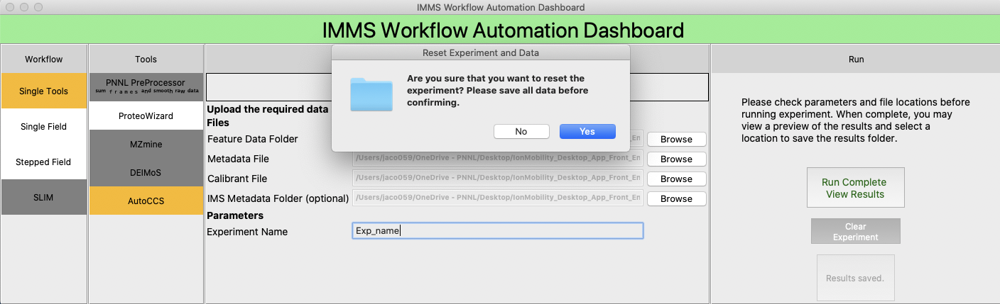

## Ion Mobility Mass Spec Dashboard

[to edit this]
You can use the [editor on GitHub](https://github.com/PNNL-CompBio/ion-mob-ms/edit/main/docs/index.md) to maintain and preview the content for your website in Markdown files. Whenever you commit to this repository, GitHub Pages will run [Jekyll](https://jekyllrb.com/) to rebuild the pages in your site, from the content in your Markdown files.

This dashboard is designed to facilitate the numerous steps required to run analysis tools required for Ion Mobility Mass Spectrometry Analysis.

## How to install  
  
While we will eventually write a script to automate the installation, the installation for either a Mac or a PC is as follows:  
Mac Installation:  
1. Download UI_V2  
2. Download [Docker Desktop for Mac](https://docs.docker.com/desktop/mac/install/)  
3. Restart computer if prompted  
4. Open Docker Desktop and UI_V2  
  
Windows Installation  
1. Download UI_V2  
2. Download [Docker Desktop for Windows](https://docs.docker.com/desktop/windows/install/)    
3. Install WSL2 via Powershell. Open "Powershell" as an **Administrator**, then type the command "wsl --install -d ubuntu"  
  
  
  
4. Restart computer  
5. Open Docker Desktop and UI_V2  

**Dashboard Image**  

## Prepare to run
You will need a series of files to start, depending on the workflow you want to run.

## Select your Workflow

There are generally three types of workflows to run:

### DTIMS Single field
Drift tube ion mobility mass spectrometry requires knowledge of experiments and a table of calibration ions.

### SLIM data (also single field)
Data from the SLIM machine.

### DTIMS Stepped field
Drift tube ion mobiology mass spectrometry that requires specific known targets and their masses.
Each mode has separate needs for input files, but runs a combination of the modules depicted below.

### Single Tool Option 
This option is selected to run tools individually.

## Select your Tool 

Select which tool you would like to run. If AutoCCS is selected, choose single field, stepped field, or SLIM depending on your experiment.

 
  
If AutoCCS is selected, choose single field, stepped field, or SLIM depending on your experiment.  

 

## Upload your files
  
To upload files/folders, please sort each file type into their own folder, then select the folder by clicking "Browse".  
For example, all Raw data files should be placed in a single folder without any other files. This is the same for Ims Metadata files, and Feature files.  
While browsing, any "Folder" upload will hide all individual files to avoid improper selections.  
 
Individual File uploads do not require folders and may be selected directly. These include: Calibrant File, Target List File, and Metadata File.  

Once files are uploaded, select the Run tab.  

 

## Run Experiment  

Prior to selecting "Run Experiment", Docker must be open. Docker is required to run each of the tools.  
  
  
  
Please confirm all variables and path locations before running experiment.  

 
  
When running experiment, do not exit the application or Docker. Doing so may result in temporary files (such as .tar files in data folders) not being deleted. 
If exited early, please ensure no temporary files exist in experimental folders before running again.  
  
## Viwing and Saving Results  

After the experiment is completed, a "Save Results" button should appear. Press the button to choose a folder to move results to.  

 
  
If CCS Values were generated, a summary graph or PDF will be available to preview depending on the experiment type.  

## Running Additional Experiments

To clear all parameters and results, select the "Clear Experiment" button and confirm.  

 

## Available Tools

<<<<<< main
Currently we have enabled the use of the following tools. 

### PNNL PreProcessor Tool
Docker image and script to run [PNNL Pre-Processor tool](https://pnnl-comp-mass-spec.github.io/PNNL-PreProcessor).

### ProteoWizard Tool
Docker image and script to run [ProteoWizard tool](https://proteowizard.sourceforge.io/)

### MZMine Tool
Docker image and script to run [MZMine Java Program](http://mzmine.github.io/).

### AutoCCS Tool
Docker image and script to run [AutoCCS Python script](https://github.com/PNNL-Comp-Mass-Spec/AutoCCS).

### ion-mob-UI
This is the front-end for the entire workflow.  TODO: determine implementation and design.

## Citation
